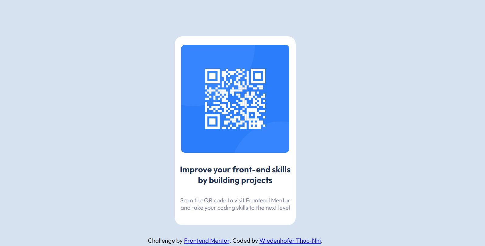

# Frontend Mentor - QR code component solution

This is a solution to the [QR code component challenge on Frontend Mentor](https://www.frontendmentor.io/challenges/qr-code-component-iux_sIO_H). Frontend Mentor challenges help you improve your coding skills by building realistic projects.

## Table of contents

- [Overview](#overview)
  - [Screenshot](#screenshot)
  - [Links](#links)
- [My process](#my-process)
  - [Built with](#built-with)
- [Author](#author)

## Overview

### Screenshot

### Links

- Solution URL: [Github](https://github.com/thucnhi-wiedenhofer/QR_code_component.github.io)
- Live Site URL: [live site](https://thucnhi-wiedenhofer.github.io/QR_code_component.github.io/)

## My process

### Built with

- Semantic HTML5 markup
- CSS custom properties
- Flexbox

## Author

- Website - [portfolio](https://thuc-nhi-wiedenhofer.students-laplateforme.io/)
- Frontend Mentor - [@thucnhi-wiedenhofer](https://www.frontendmentor.io/profile/thucnhi-wiedenhofer)
